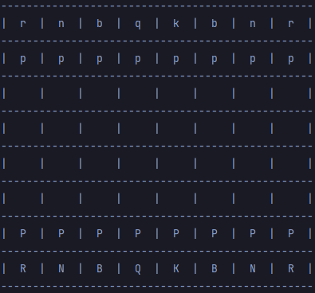

## Education
2021 - Present AGH UST

2018 - 2021 The August Witkowski 5th High School in Cracow

## Projects I currently work on
1.[Chess engine](https://github.com/AGH-Narzedzia-Informatyczne-2021-2022/mknl)

Nasz projekt polegał na stworzeniu od zera w pełni funkcjonalnego silnika szachowego. Niestety nie udało się stworzyć silnika jednak udało się stworzyć w pełni funkcjonalną szachownicę. Planowaliśmy również stworzyć interfejs graficzny, którego jednak nie udało się połączyć z aplikacją na czas. Nasza szachownica w trybie konsolowym jako wejście od użytkownika dostaje opis ruchu w notacji algebraicznej, sprawdza legalność ruchu na bieżąco, wykonuje go na planszy i wypisuje ją na ekran. Na razie dostępny jest tylko tryb rozgrywki gracz przeciwko graczowi, gdyż silnik nie istnieje.
 


Pozostali autorzy:
1. [Miłosz Dubiel](https://dubielel.github.io)
2. [Łukasz Łabuz](https://luklabuz.github.io)
3. [Natalia Niedziałek](https://natiniedzialek.github.io)
4. [Mateusz Piękoś](https://matpiekos.github.io)
5. [Krzysztof Wójcik](https://hoshiharahikari.github.io)

## My sample code
```python
          def fen_update_add_current(list_fen, target_file, fen_file, piece, i):
        left_space = target_file - fen_file
        right_space = 0

        if i + 1 != len(list_fen):
            if list_fen[i + 1] == '/':
                right_space = 8 - (target_file + 1)
            elif list_fen[i].isnumeric():
                right_space = int(list_fen[i]) - (left_space + 1)

        help_fen = list_fen[:(i + 1)]

        if left_space:
            help_fen[i] = str(left_space)
            help_fen.append(piece)
        else:
            help_fen[i] = piece

        if right_space != 0:
            help_fen.append(str(right_space))

        help_fen += list_fen[(i + 1):]
        list_fen = help_fen

        return list_fen
```


